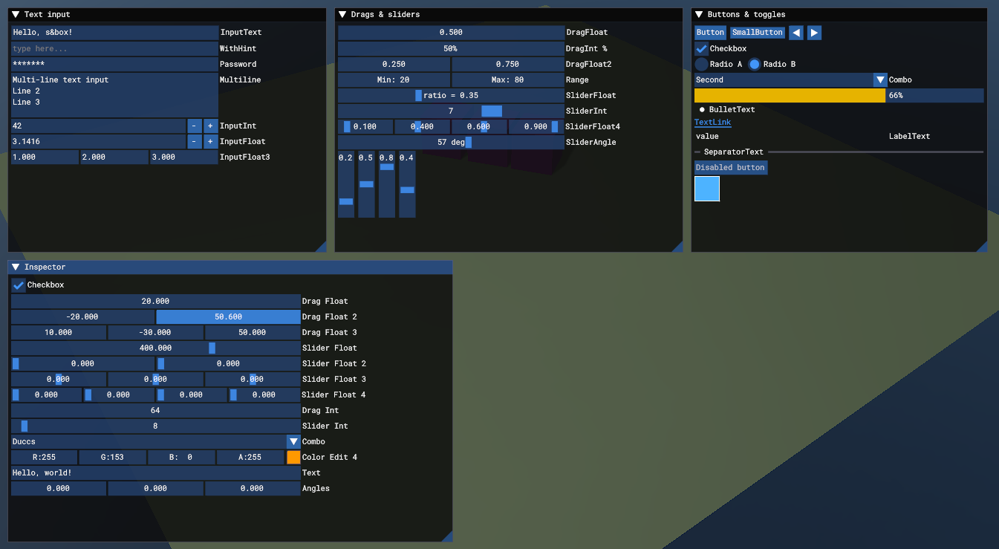

# Dear ImGui

A C# port of the [Dear ImGui](https://github.com/ocornut/imgui) 1.91 API, rendered through s&box's `Painter`. Call the
static `ImGui` class from any component's `OnUpdate`; `ImGuiSystem` starts and draws the frame for you. Drop-in components
show the demo window or inspect another component's properties without code. For developers who want debug panels, tools
and in-game editors with the API they already know. Forked from [chrisspieler/sbox-imgui](https://github.com/chrisspieler/sbox-imgui) and completed.



## Requirements

None.

## Install

Search for **Dear ImGui** in the s&box library manager, or add `duccsoft.imgui`.

## Quick start

### In the editor

1. Add a GameObject to your scene.
2. Add the **ImGui Demo Window** component: the Dear ImGui demo window appears in play mode.
3. Optional: add **ImGui Inspector** and set its Target to another component to edit its `[Property]` values in an ImGui window.

`Assets/scenes/imgui_demo.scene` has all sample components wired together.

### In code

```csharp
using Duccsoft.ImGui;

protected override void OnUpdate()
{
	Mouse.Visible = true; // ImGui needs a visible cursor to be clicked
	if ( ImGui.Begin( "Debug" ) )
	{
		ImGui.Text( "Hello, world {0}", 123 );
		if ( ImGui.Button( "Save" ) ) Save();
		ImGui.SliderFloat( "Speed", ref _speed, 0f, 10f );
	}
	ImGui.End();
}
```

Every widget, with examples: [docs/USAGE.md](docs/USAGE.md).

## Options

| Option | Default | What it does |
|---|---|---|
| `imgui_enabled` (ConVar) | `true` | Process and draw ImGui windows. |
| `imgui_mouse_capture` (ConVar) | `true` | ImGui captures mouse input over its windows. |
| `ImGuiSystem.RenderEnabled` | `true` | When false, ImGui runs and receives input but is not drawn. |
| `ImGuiSystem.SimulateInput` | `false` | Stop reading the real mouse/keyboard; feed input through `ImGui.GetIO()` yourself (tests, replays). |
| `ImGui.GetIO().AutoScale` | `true` | Scale sizes and fonts so the UI looks the same at any resolution (reference 1080p). |
| `ImGui.GetIO().FontName` / `FontSize` | `Roboto Mono` / `15` | Font family and pixel size at 1080p. |
| `ImGui.GetStyle()` | Dear ImGui dark | Sizes and colors; edit live with `ImGui.ShowStyleEditor()`. |

## How it works

`ImGuiSystem` (a `GameObjectSystem`) starts an ImGui frame before components update and renders all windows after they
update into a HUD command list on the main camera. Input comes from an invisible full-screen UI panel that only swallows
mouse and keyboard events while ImGui wants them (`io.WantCaptureMouse`, `io.WantTextInput`). Widgets, windows, tables and
the demo follow the Dear ImGui source closely, so most C++ examples translate line by line. Drawing goes through `ImDrawList`,
which records `Painter` shapes and GPU text instead of vertex buffers. Details and the differences from Dear ImGui are in
[docs/USAGE.md](docs/USAGE.md).

## Multiplayer

Local UI only: works in single-player, as host and as client. Each machine draws its own windows; nothing is synced.

## Limitations

- No keyboard/gamepad navigation between items; mouse and text editing are complete.
- No docking or multi-viewports. Window positions and table settings last for the session; there is no .ini file.
- No font atlas API: any font family s&box can render, sized in pixels.
- Per-vertex color gradients are approximated with strips and flat-shaded segments.
- Clipboard paste only arrives through the OS paste event (Ctrl+V); s&box has no clipboard read API.
- `TextLinkOpenURL` copies the URL to the clipboard instead of opening a browser.

## Development

- Compile: `dotnet build Code\imgui.csproj` (generated by the s&box editor), then `sbox-check`.
- In-engine tests and screenshots: `dev\editor-rig\start-editor.ps1` opens a scratch editor with sbox-mcp, then
  `sh dev/editor-rig/run-selftest.sh` runs the self-test (32 interaction tests). See [docs/USAGE.md](docs/USAGE.md#verification).
- No plain .NET tests: all code depends on s&box types, so there is no Core layer.

## License

MIT (see LICENSE). Dear ImGui is MIT licensed by Omar Cornut.
